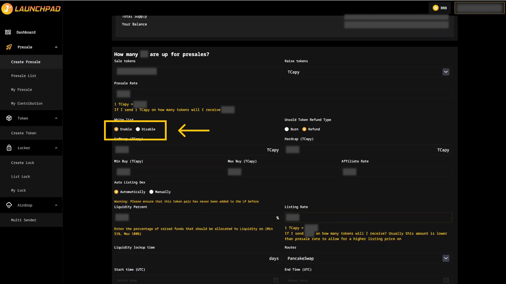
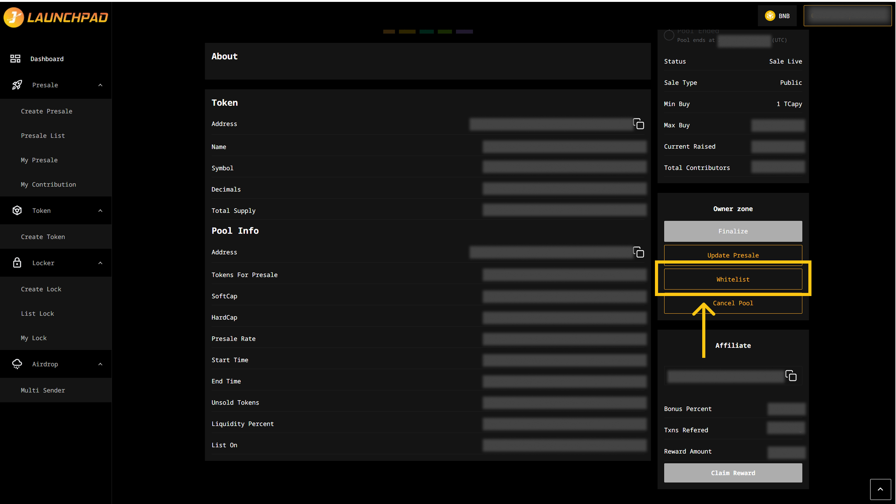
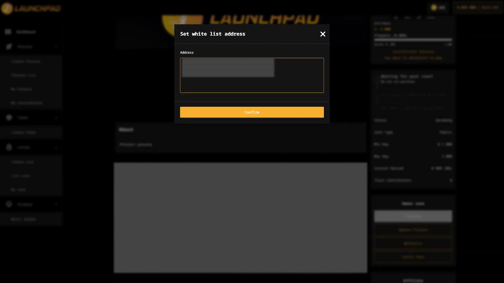
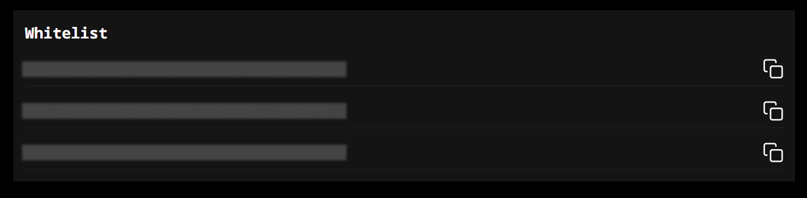

# Add Whitelist

Whitelist on JLaunchpad is list of administrator-approved addresses whereby, only these addresses can participate in the presale. The whitelist function can be both enabled/disabled during the creation of a presale, prior to the beginning of the presale.

### Enable Whitelist

When creating the presale, you can choose to enable whitelist here by clicking on “Enable” in “Whitelist” section.

<figure><figcaption></figcaption></figure>

_Note: The whitelist can only be enabled/disabled at the time of creating the presale. If you choose to disable the whitelist, the presale will be treated as a public sale._

### **How to Add Whitelist**

You can add wallet addresses of presale participants anytime, before or even during the presale.

**Step 1: Add Whitelist**

You can do it by clicking on “Whitelist” in the Owner Zone of your presale.

<figure><figcaption></figcaption></figure>

**Step 2: Add Addresses**

1. After clicking on “Whitelist”, you will see a pop-up box. Here, you can add addresses to your whitelist. Addresses are separated by a new line and no comma, the below list can be used as an example:

* 0xF2BfD5e508A17744118E120D6029cE27F840D7d7
* 0xff80962D3da2651fcfaC8dEbccdBB493c177d613
* 0x4BB5E1035D1D7ed843e96308B8d49D9a3a1f4B9a

_Note: You can add up to 800 addresses to your whitelist each time._

2. Click on “Confirm” when you are done inputting the addresses, then, MetaMask will now ask you to confirm the transaction. It will also show you the fee that you are required to pay for that transaction. If you agree, then click on the “Confirm” button to finish the process.

<figure><figcaption></figcaption></figure>

**Step 3: View Whitelist**

Upon successfully adding the whitelisted addresses, they will be displayed in the "Whitelist" section, located below the "Token" section. You can view the list of whitelisted addresses in this section.

<figure><figcaption></figcaption></figure>
