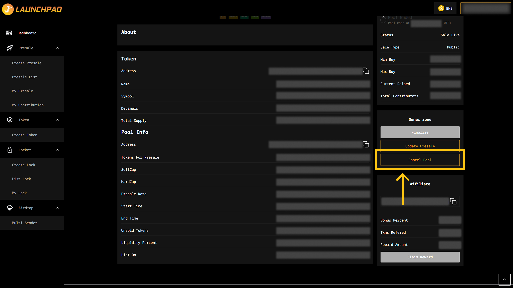

# Cancel a Presale

After the presale is launched, in case you change your mind and want to cancel your presale, you can use "Cancel Pool" button at the Owner Zone section.

1. Connect your wallet. In this article, we will use MetaMask wallet as an example.
2. From the homepage, click on "Presales" then "My Presale".
3. Then, click on "View Detail" on your presale pool that you wish to cancel.
4. Click "Cancel Pool" button in the Owner Zone.

MetaMask will now ask you to confirm the transaction. It will also show you the fee that you are required to pay for that transaction. If you agree, then click on the “Confirm” button to finish the process.

<figure><figcaption></figcaption></figure>
