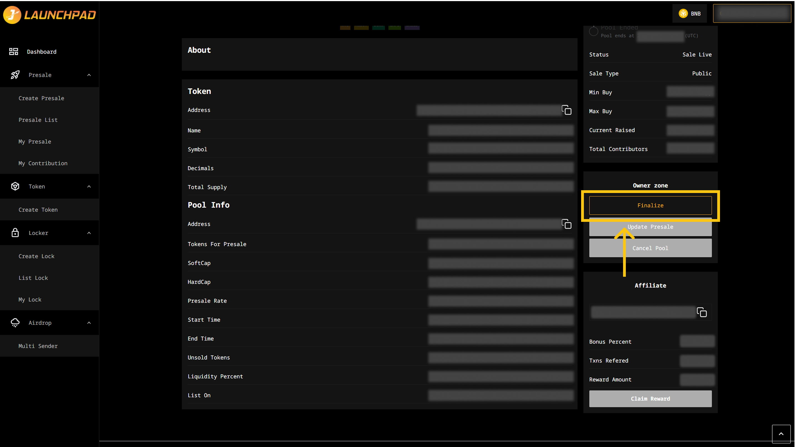

# Finalize a Presale

Once your presale has met Softcap and ended/ met Hardcap, you can use "Finalize" button at the Owner Zone section to finalize your presale.

1. Connect your wallet. In this article, we will use MetaMask wallet as an example.
2. From the homepage, click on "Presales" then "My Presale".
3. Then, click on "View Detail" on your presale pool that you wish to finalize.&#x20;
4. Click "Finalize" button in the Owner Zone.
5. MetaMask will now ask you to confirm the transaction. It will also show you the fee that you are required to pay for that transaction. If you agree, then click on the “Confirm” button to finish the process.

<figure><figcaption></figcaption></figure>

## **Error when Finalizing**

After your presale has met softcap and ended or reached hardcap, or if you can't finalize your presale, you may follow these steps to list your token:

If your token has fees, rewards, and max tx in the contract, you have to exclude those functions for the presale address in order to finalize the presale pool.

1. Before you finalize your presale, you need to access your contract address from BSC Block Explorer or you can click on the "token address" on your presale page.
2. Go to Contract -> Write contract -> Connect to Web3 to connect your wallet, you need to use owner address.
3. Ctrl + F, Search “exclude”, then input your presale address, then click on "Write", to exclude fee, reward, max tx for the presale address.
4. After click on the “Write” button, MetaMask will now ask you to confirm the transaction. It will also show you the fee that you are required to pay for that transaction. If you agree, then click on the “Confirm” button to finish the process. If you see exclude (bool), please input “True”.

_Note: Sometimes the contract doesn’t have “exclude” but "exempt" instead, search “exempt”, then input your presale address, then click on "Write" to exclude fee, reward, max tx for the presale address._

5. In the “Pool Actions” section, you can choose to click on “Finalize” to complete the Launchpad and list your token, or you can choose to cancel it.
6. MetaMask will now ask you to confirm the transaction. It will also show you the fee that you are required to pay for that transaction. If you agree, then click on the “Confirm” button to finish the process.

**Reminder**: If you still can't finalize the pool please hire a trusted developer to help you check your smart contract. There must be a problem with your contract.

\
