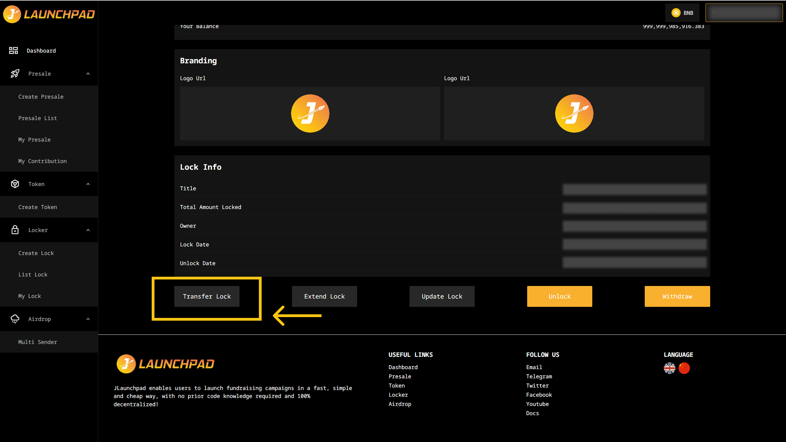
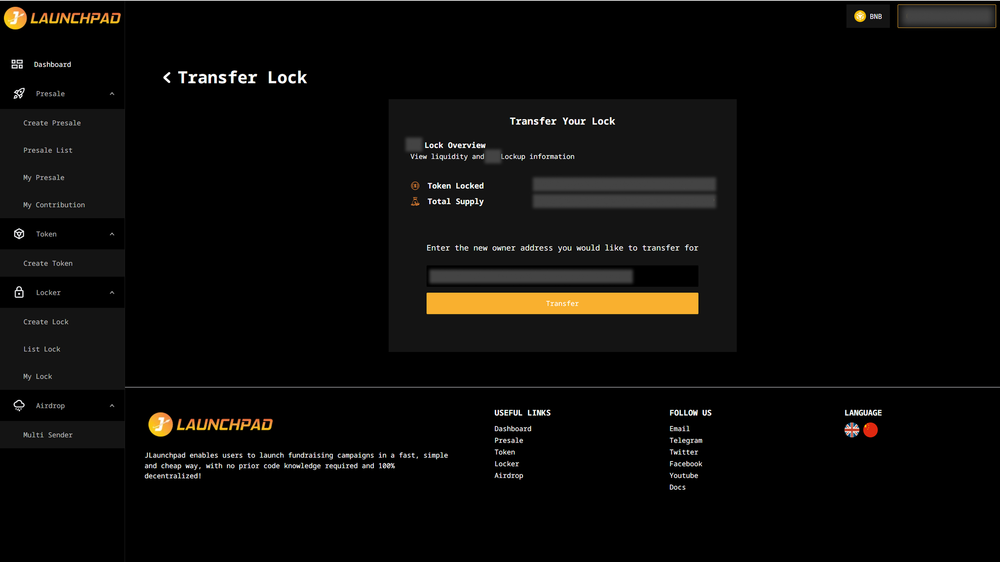
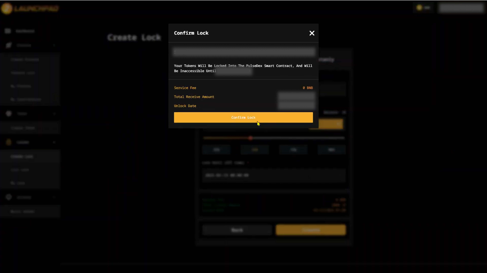

# Transfer Lock Ownership

## Step 1: Transfer Lock

1. Connect your wallet. In this article, we will use MetaMask wallet as an example.
2. From JLaunchpad’s homepage, go to the "Lock Tool" page, click on “My lock” and click “View Detail” on the token you want to transfer lock ownership.
3. After that, scroll to the bottom and click "Transfer Lock" button.

<figure><figcaption></figcaption></figure>

## Step 2: Insert New Owner Address

Insert your new owner address and click “Transfer”.

<figure><figcaption></figcaption></figure>

## Step 3: Confirmation

1. A pop-up will appear, check on the details and proceed by clicking on "Confirm Transfer".&#x20;
2. Then, MetaMask will now ask you to confirm the transaction. It will also show you the fee that you are required to pay for that transaction. If you agree, then click on the “Confirm”.

<figure><figcaption></figcaption></figure>
