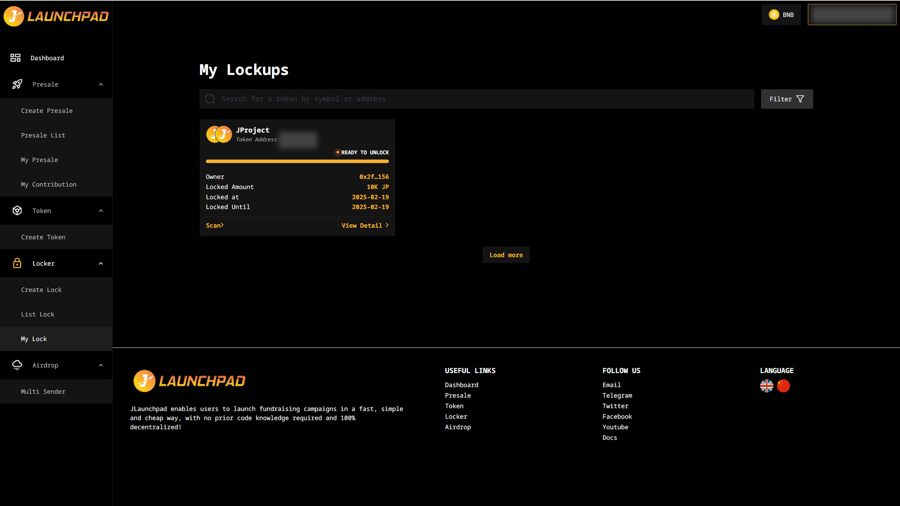
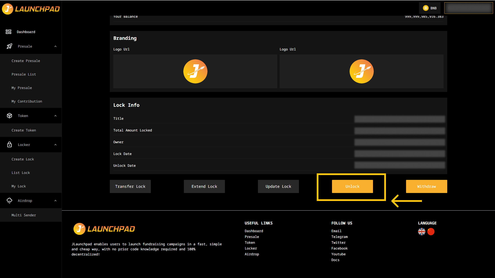
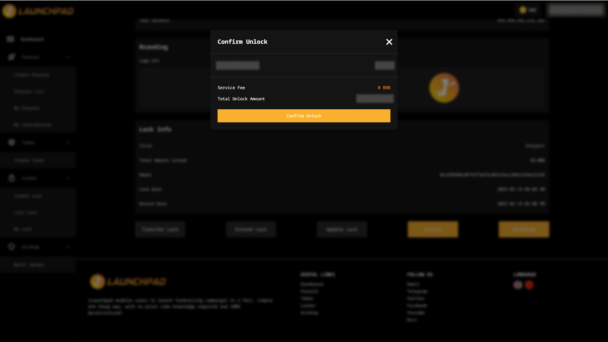

# Unlock Token

Upon the locking cycle ended, project owners can navigate to the JLaunchpad Lock Tool page and release the locked tokens by selecting the "Unlock" button.

## Step 1: My Lock

1. Connect your wallet. In this article, we will use MetaMask wallet as an example.
2. From the homepage, navigate to the "Lock Tool".
3. Select "My Lock" and click "View Detail" on the locked token you wish to unlock.

**Note**: You can only unlock when the lock status is "READY TO UNLOCK".

<figure><figcaption></figcaption></figure>

## Step 2: Unlock

Scroll down and click "Unlock".

<figure><figcaption></figcaption></figure>

## Step 3: Confirmation

1. A confirmation pop-up will appear; proceed by selecting "Confirm Unlock".
2. MetaMask will prompt you to confirm the transaction and display the associated transaction fee. If you agree, click the "Confirm" button to complete the approval process.

<figure><figcaption></figcaption></figure>

**Note**: Do check your wallet balance to check the amount of the presale tokens. In case if you forgot to add token to wallet in the previous step, you may import your token into your wallet using the token address. Don't know how? View here. We recommend that you follow the social media channels of the project to check their updates.
