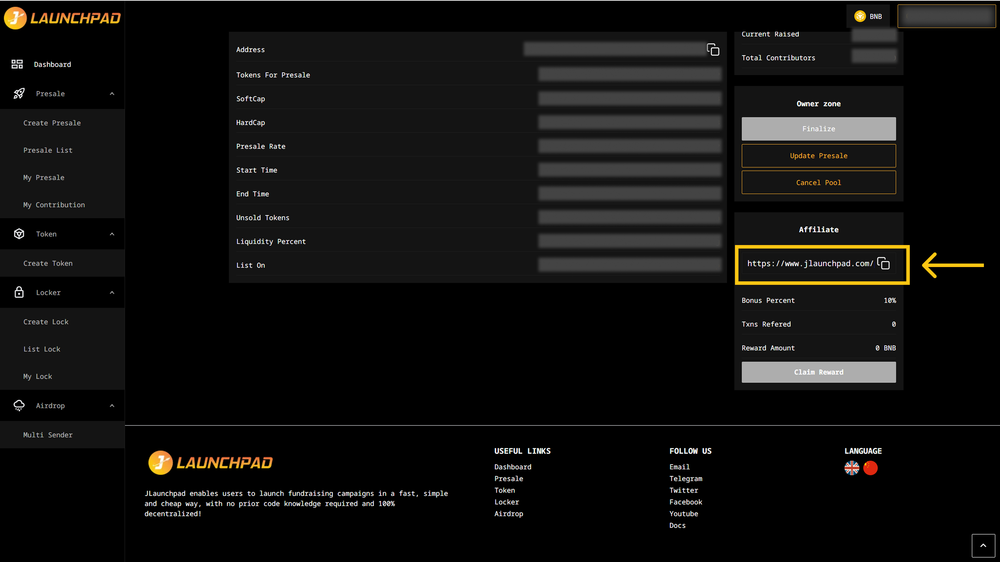

# Affiliate Program

#### AFFILIATE REWARDS CALCULATION

* Only the project owner has the authority to set the affiliate reward percentage, with a maximum cap of 10% of the hard cap.
* Rewards become claimable once the presale is successfully finalized.

Affiliate Rewards = Amount of raise token bought x Affiliate Rate

#### EXAMPLE CALCULATION

Suppose the affiliate rate is set at 5%, and the total contributions made through your referral link amount to 1,000 BNB. Your reward would be: **1,000 BNB × 5% = 50 BNB**

If three different users contribute using your referral link:

* Peer A contributes 500 BNB
* Peer B contributes 300 BNB
* Peer C contributes 200 BNB

The total amount referred is **500 + 300 + 200 = 1,000 BNB**, which results in an affiliate reward of **50 BNB**.

#### HOW TO GET YOUR AFFILIATE LINK?

1. From the homepage, click on “Presales”.
2. Click “View Detail” on the presale that you want to share.
3. Scroll down to the Affiliate section, click on the “Copy” icon to copy the link.
4. You may now begin to share the link to your peers for the rewards.

<figure><figcaption></figcaption></figure>

#### HOW TO CLAIM YOUR AFFILIATE REWARDS?

1. From the homepage, click on “Presales”.
2. Click “View Detail” on the presale that you shared.
3. Once the owner of the presale has finalized, you may click on the “Claim Reward” button.
4. MetaMask will now ask you to confirm the transaction. It will also show you the fee that you are required to pay for that transaction. If you agree, then click on the “Confirm” button to finish the process.

<figure><figcaption></figcaption></figure>
