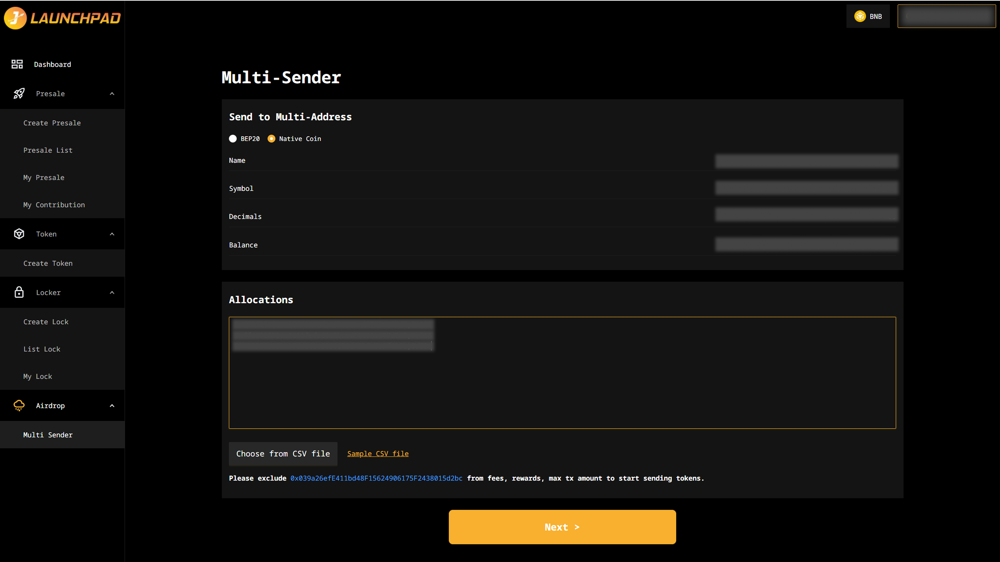
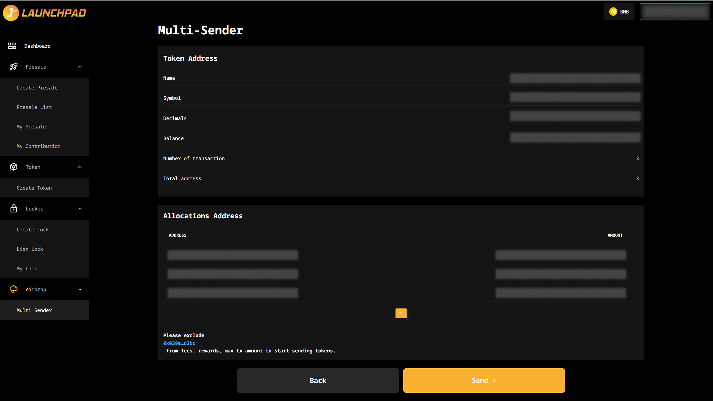

# Airdrop

## Step 1: Add Your Allocation

1. Connect your wallet. In this article, we will use MetaMask wallet as an example.
2. From the homepage, navigate to "Airdrops" and select "Multi-Sender".
3. Input your token address if you are not sending BNB.
4. Input allocations (you must use positive numbers) for multi-sender, here’s a simpler structure to follow.

Example:

0xF2BfD5e508A17744118E120D6029cE27F840D7d7,0.002

0xff80962D3da2651fcfaC8dEbccdBB493c177d613,0.005

0x4BB5E1035D1D7ed843e96308B8d49D9a3a1f4B9a,0.001

_Or you can use CSV file if you have many addresses you need to send._

**Note**: Make sure there’s no empty space in between.

5. Click "Next" to continue the process.

<figure><figcaption></figcaption></figure>

Remember to exclude fees, rewards, max tx amount for your wallet address to start sending tokens.

## Step 2: Confirmation

1. Review addresses and amount to be sent. You may click “Back” to edit when necessary, otherwise, proceed to click “Send”.
2. MetaMask will now ask you to confirm the transaction. It will also show you the fee that you are required to pay for that transaction. If you agree, then click on the “Confirm” button to finish the process.

<figure><figcaption></figcaption></figure>
