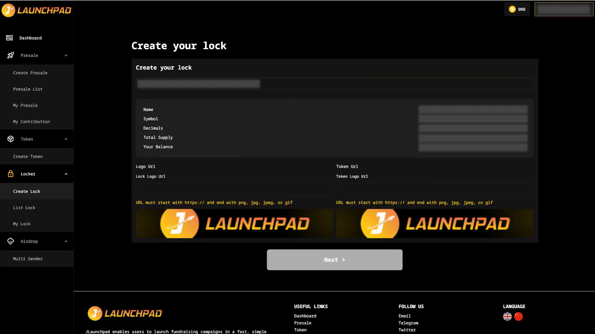
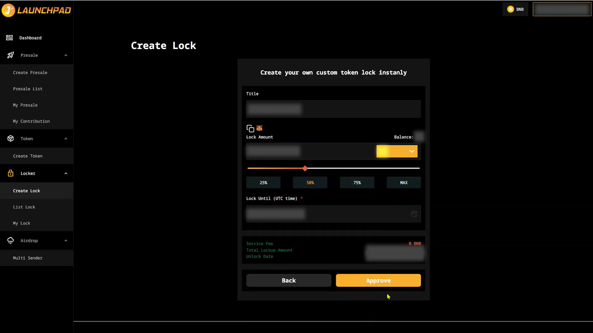
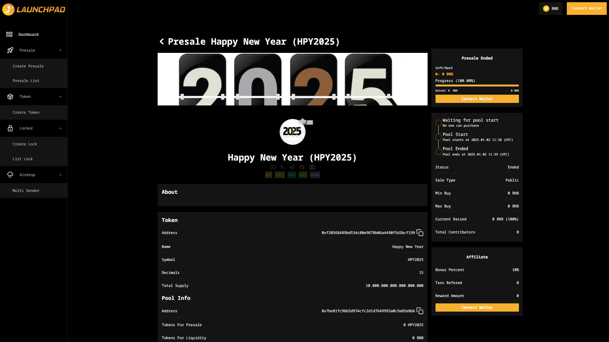

# Create a Lock

## Step 1: Token Verification

1. Connect your wallet. In this article, we will use MetaMask wallet as an example.
2. From homepage, access "Lock Tool" and click on "Create Lock".
3. Input your token address.
4. Check on the details of your presale token and fill in the "Lock Logo URL" and "Token Logo URL". These are the required fields, cannot be blank. You can’t complete this step without those.&#x20;
5. Logo URL must end with a supported image extension: png, jpg, jpeg or gif.&#x20;

&#x20;       Example: [https://beurl.app/JLaunchpad-logo](https://beurl.app/JLaunchpad-logo)

6. Click on the "Next" button to create lock.

<figure><figcaption></figcaption></figure>

## Step 2: Create Lock

1. Input the title of this lock, "JProject" for example.
2. Enter the number of tokens you want to lock (numbers only, no percentages). Or, you can click on the percentage to automatically fill in the amount of tokens you want to lock.
3. Click on "Approve". MetaMask will now ask you to confirm the transaction. It will also show you the fee that you are required to pay for that transaction. If you agree, then click on the “Confirm” button to finish the "Approve" process.

<figure><figcaption></figcaption></figure>

## Step 3: Confirmation

Click on "Confirm Lock". MetaMask will now ask you to confirm the transaction. It will also show you the fee that you are required to pay for that transaction. If you agree, then click on the “Confirm Lock” button to finish the lock process.

<figure><figcaption></figcaption></figure>

**Note**: Please exclude JLaunchpad's lockup address from fees, rewards, max tx amount to start locking tokens.
