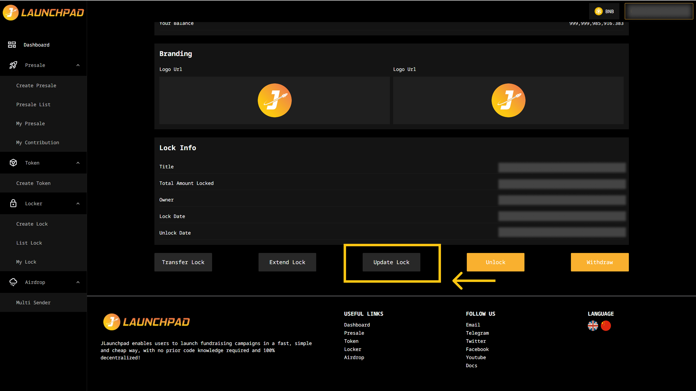
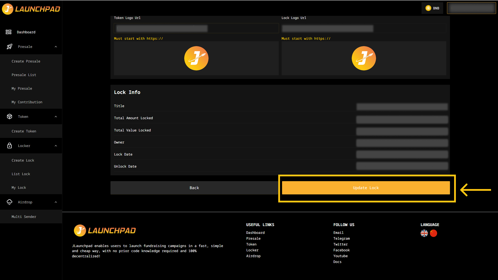

# Update a Lock Information

## Step 1: My Lock

1. Connect your wallet. In this article, we will use MetaMask wallet as an example.
2. From the homepage, navigate to the "Lock Tool".
3. Select "My Lock" and click "View Detail" on the locked token you wish to update.

<figure><figcaption></figcaption></figure>

## Step 2: Update Lock

Scroll down and click "Update Lock".

<figure><figcaption></figcaption></figure>

## Step 3: Update Information

1. Update link of the Token Logo URL and Lock Logo URL here.

When you’re sure everything is accurate, click the “Update Lock” button at the bottom right to save your changes.

<figure><figcaption></figcaption></figure>
