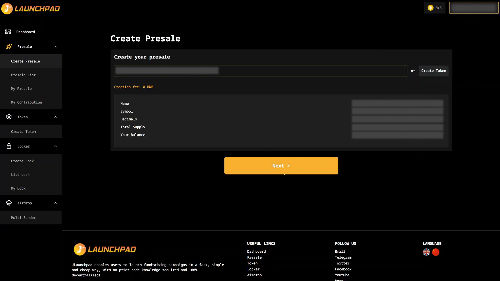
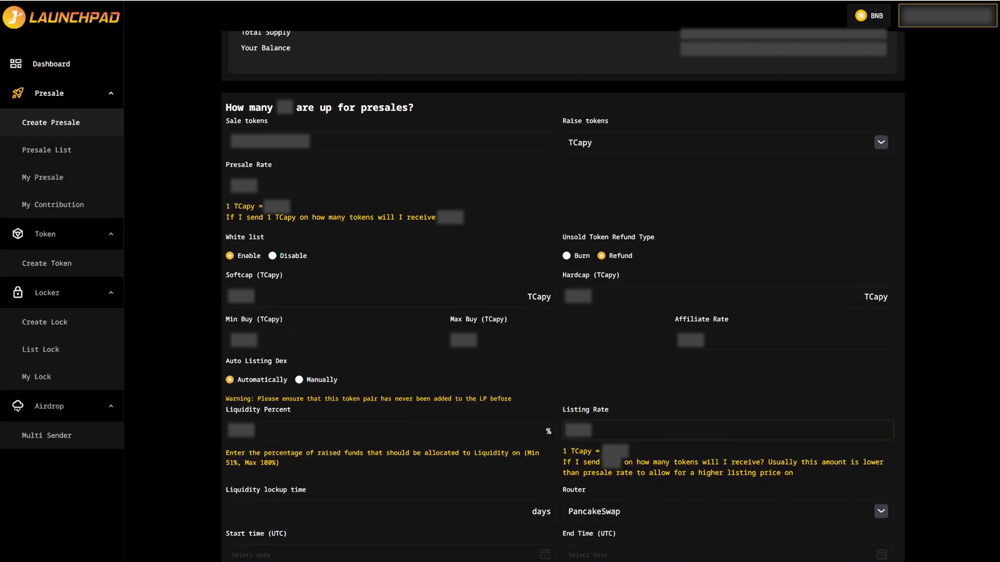
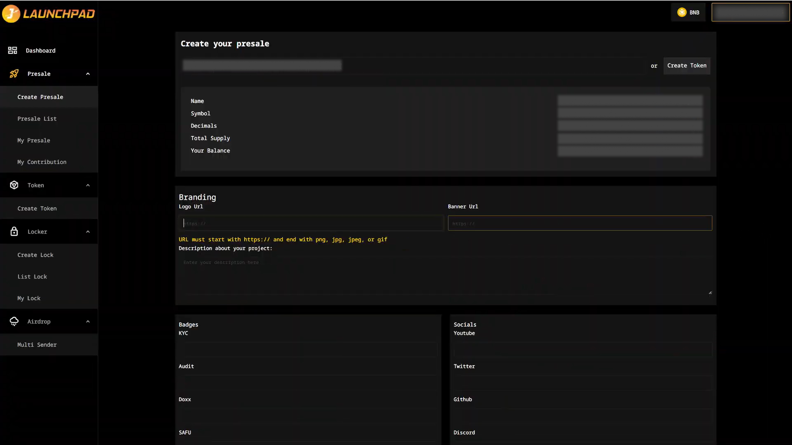
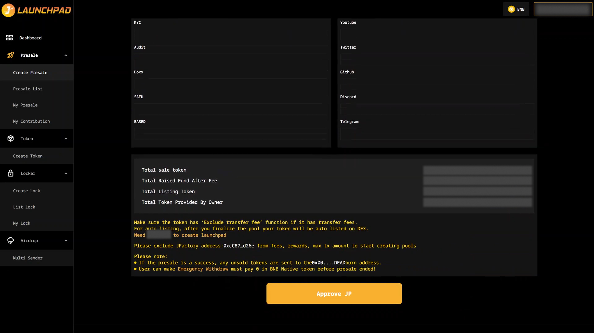

# Creat a Presale

## Step 1: Verify Token

1. Connect your wallet. In this article, we will use MetaMask wallet as an example.
2. From the homepage, select "Presales", and then click on "Create Presale".
3. Input your token address if you already have one, otherwise create a new token.
4. Review the details of the token and click “Next”.

<figure><figcaption></figcaption></figure>

## Step 2: Presale Info

After verifying your token, you need to input the Presale information that you want to raise. Here are some following important parameters:

1. You must use positive numbers.
2. Presale rate: show how many tokens they will receive during the presale stage.
3. Whitelist: Choose "Enable" if you have a whitelist of presale contributors. You can only enable/ disable at this step.
4. Hardcap must not be greater than 4 times of Softcap.
5. For refund types you can choose refund or burn from the list.
6. Liquidity (%): Enter the percentage of raised funds that you want to allocate to liquidity on router. Minimum value is 51%, maximum value is 100%.
7. Listing rate is the initial rate of the liquidity pool (1 BNB= x tokens). This rate is usually lower than the presale rate to allow a higher listing price on router.
8. Start time must be before the end time.
9. Liquidity lockup (days): Lock-up time for liquidity pool, for example 30 days.
10. You may click “Create” to proceed.

The amount of tokens needed to create the presale pool will be shown above the "Back" and "Next" buttons.

<figure><figcaption></figcaption></figure>

## Step 3: Add Additional Info

There are some notes for this step:

1. Logo URL and Banner URL are required fields, cannot be blank. You can’t complete this step without those.
2. Logo URL must end with a supported image extension: png, jpg, jpeg or gif.

Example: [https://beurl.app/JLaunchpad-logo](https://beurl.app/JLaunchpad-logo)

3. Click "Approve" after inputting.

<figure><figcaption></figcaption></figure>

## Step 4: Finish

This is the final step. You can review all the information one last time before submitting. Click “Approve Token” and you’re done!

<figure><figcaption></figcaption></figure>

\
