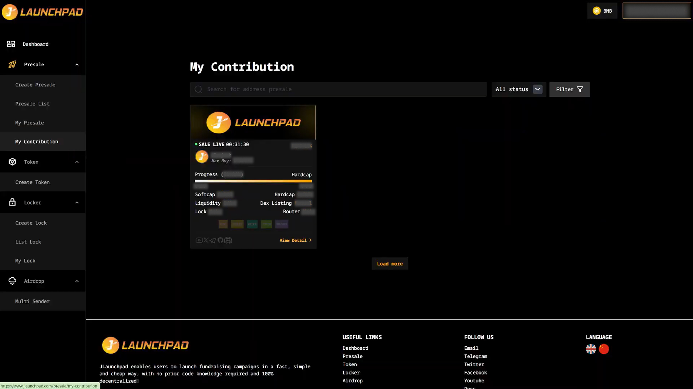
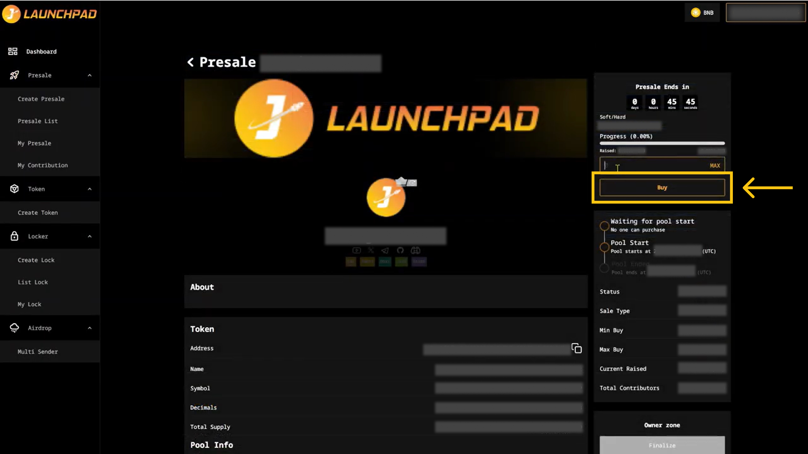
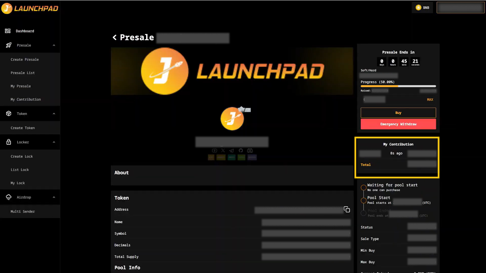

# Buy a Presale

### **Step 1: Select Presale to buy**

1. Connect your wallet. In this article, we will use MetaMask wallet as an example.
2. From the homepage, access "Presales" page and select "Presale List"
3. You can filter the presale statuses by selecting from the "All status" list. You only can buy a presale with the “Sale Live” status.
4. Hover over a presale you want and click on “View Detail”.

<figure><figcaption></figcaption></figure>

### **Step 2: Buy Presales Token**

1. After clicking on “View Detail”, you can see all the information related to that presale. You should check everything carefully before buying.
2. To buy the presale, insert the amount of BNB (or TCAPY, ZUKI, JLP,... depending on the pool) that you want to use to buy at the “Amount” section. The corresponding amount of presale tokens will be calculated automatically within the BNB amount.&#x20;

* If using BNB, you can proceed directly by clicking the “Buy” button.
* If using other raise tokens, you must first approve the token before buying. Click the “Approve” button, confirm the transaction, and then proceed with the purchase by clicking “Buy.”

3. MetaMask will now ask you to confirm the transaction. It will also show you the fee that you are required to pay for that transaction. If you agree, then click on the “Confirm” button to finish the process.

<figure><figcaption></figcaption></figure>

### Step 3: My Contribution

After buying, you will see the total amount presale token you’ve purchased at “My Contribution” section.

<figure><figcaption></figcaption></figure>
