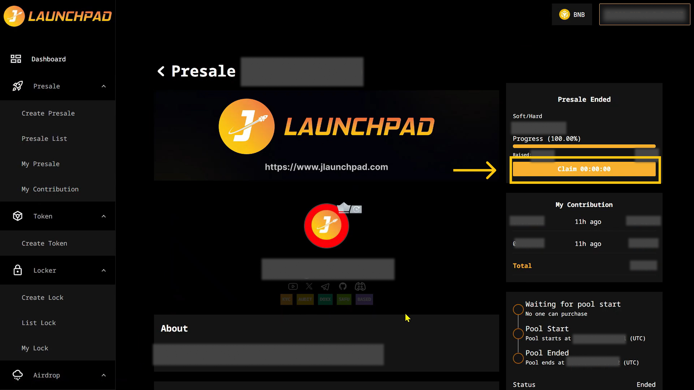

# Claim Presale Token

After taking part in and purchasing a token on presale, next you'll want to claim your presale tokens.

After the Softcap / Hardcap has been reached and owner finalized the pool, you can claim your presale tokens once the “Claim” button is available.&#x20;

1. Connect your wallet. In this article, we will use MetaMask wallet as an example.&#x20;
2. From the homepage, click on "Presale" then "My Contribution".
3. Click on "View Detail" on the Presale that you would like to claim token from.
4. At the right side, you may click on the "Claim" button once the owner has finalized the presale.
5. MetaMask will now ask you to confirm the transaction. It will also show you the fee that you are required to pay for that transaction. If you agree, then click on the “Confirm” button to finish the process.

<figure><figcaption></figcaption></figure>

**Note**: Do check your wallet balance to check the amount of the presale tokens. In case if you forgot to add token to wallet in the previous step, you may import your token into your wallet using the token address. Don't know how? View here. We recommend that you follow the social media channels of the project to check their updates.
