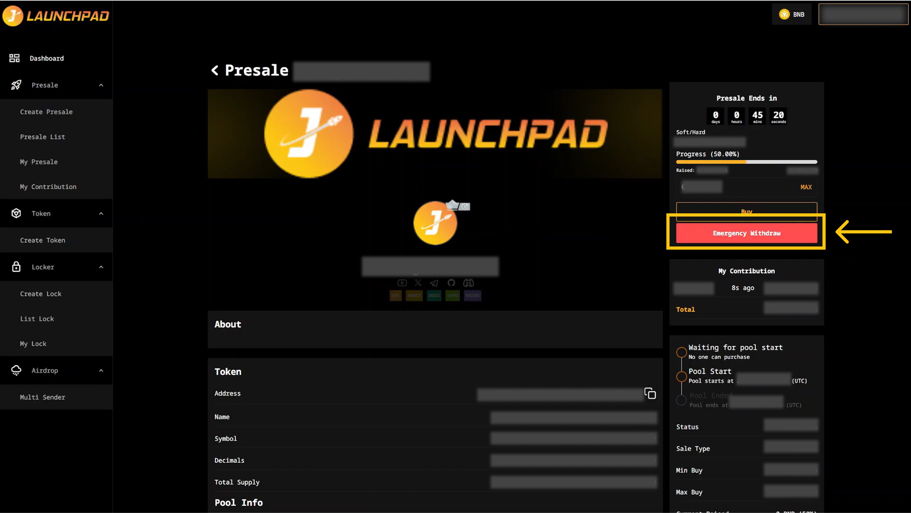

# Emergency Withdraw

After taking part in and purchasing a token on presale, in case you change your mind and want to withdraw your contribution back, you can use "Emergency Withdraw" button for a penalty fee of 10% of your contribution.

1. Connect your wallet. In this article, we will use MetaMask wallet as an example.&#x20;
2. From the homepage, click on "Presales" and select "My Contribution".
3. Next, click on the "Emergency Withdraw" button to withdraw.
4. Then, MetaMask will now ask you to confirm the transaction. It will also show you the fee that you are required to pay for that transaction. If you agree, then click on the “Confirm” button to finish the process.

<figure><figcaption></figcaption></figure>

**Note:**

* Emergency withdrawal takes your contribution (with 10% penalty) out of Presale Pool
* If the Hardcap has reached faster than the timer then you can use "Emergency Withdraw" button until the timer would run out of the presale.
