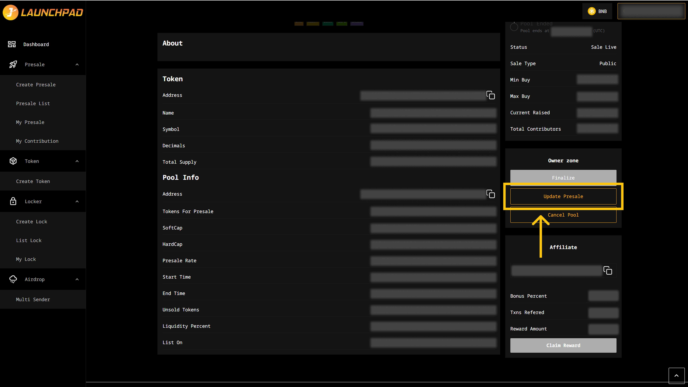

# Update a Presale Information

## Step 1: Update Presale

1. From the homepage, click on “My Presale”, you'll be able to see your presale pool here and click on "View Detail".
2. Scroll to the Owner Zone, click on the “Update Presale” button.

<figure><figcaption></figcaption></figure>

## Step 2: Edit Details

1. You can edit the following fields: Logo URL, Banner URL, YouTube, Twitter, Github, Discord, Telegram and project description. Some important notes concerning these sections.
2. Click on “Update Presale” after you are done editing to finish the process.

Important: Once each badge link is updated, please contact us at https://t.me/JLaunchpad to complete the verification process.

<figure><figcaption></figcaption></figure>

\
