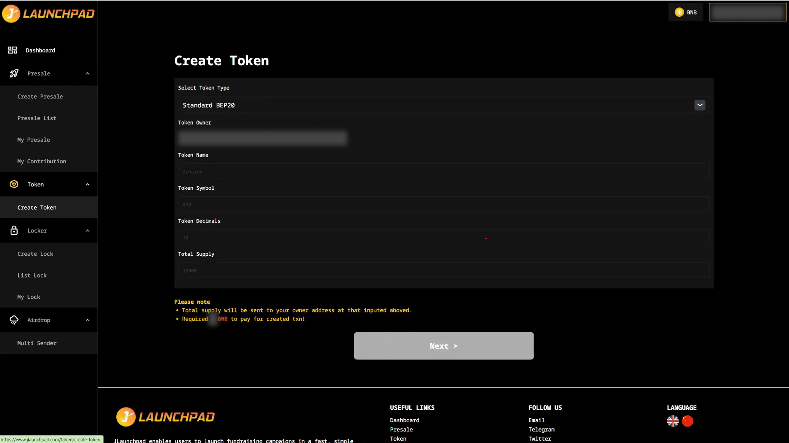
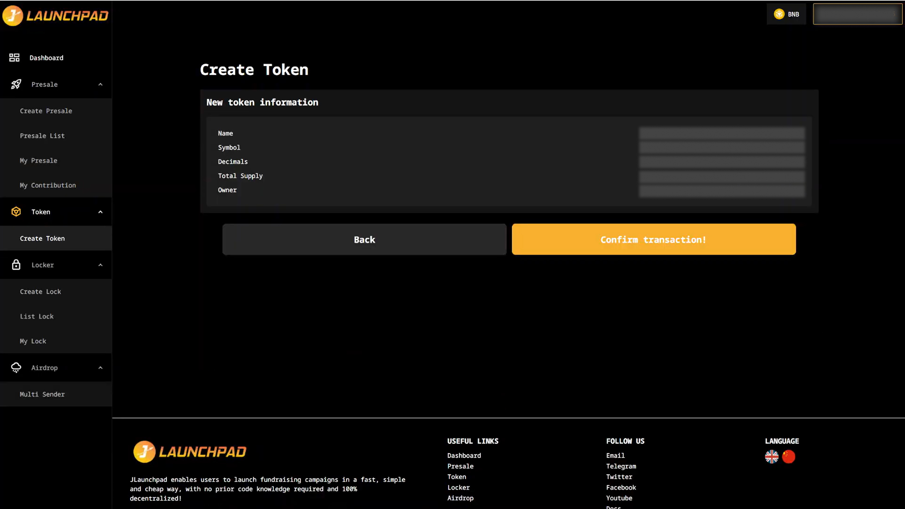
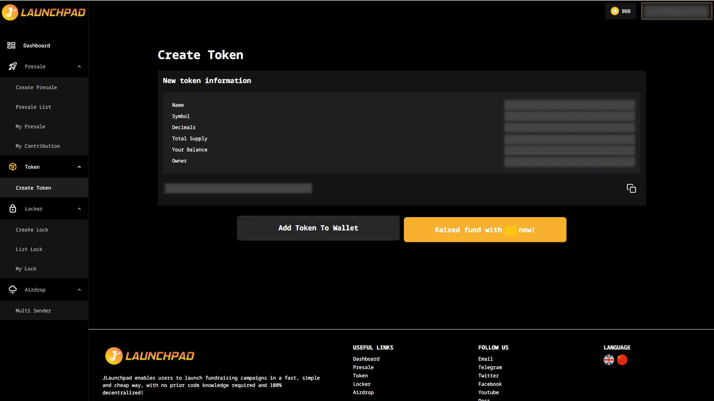

# Token

## Step 1: Create Token

Check out the steps below for how to create a standard token with JLaunchpad using your MetaMask wallet on your desktop.

1. Connect your wallet. In this article, we will use MetaMask wallet as an example.
2. From the homepage, navigate to "Token" and select "Create Token".
3. Complete all the required fields, then click "Next" to proceed.
   1. All fields are required, they cannot be blank.
   2. Decimals and the total supply must be a positive number.

<figure><figcaption></figcaption></figure>

## Step 2: Token Details

1. At this stage, you can review the token details. If any changes are needed, you may click "Back" to edit the information. Otherwise, proceed to the next step by selecting "Confirm Transaction!".
2. MetaMask will now ask you to confirm the transaction. It will also show you the fee that you are required to pay for that transaction. If you agree, then click on the “Confirm” button to finish the process.

<figure><figcaption></figcaption></figure>

## Step 3: Confirmation

1. Next, you have the option to click "Add Token to MetaMask" if desired. You have completed the token creation process!
2. Now, if you want to launch a presale right away, you may proceed by selecting "Raise Fund with Token now!".
3. In case if you forgot to add token to wallet in the previous step, you may import your token into your wallet using the token address. Don't know how? [View here.](https://support.metamask.io/manage-crypto/portfolio/how-to-import-a-token-in-metamask-portfolio/)

<figure><figcaption></figcaption></figure>
